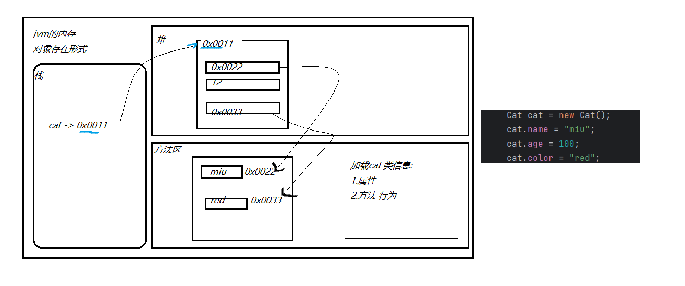
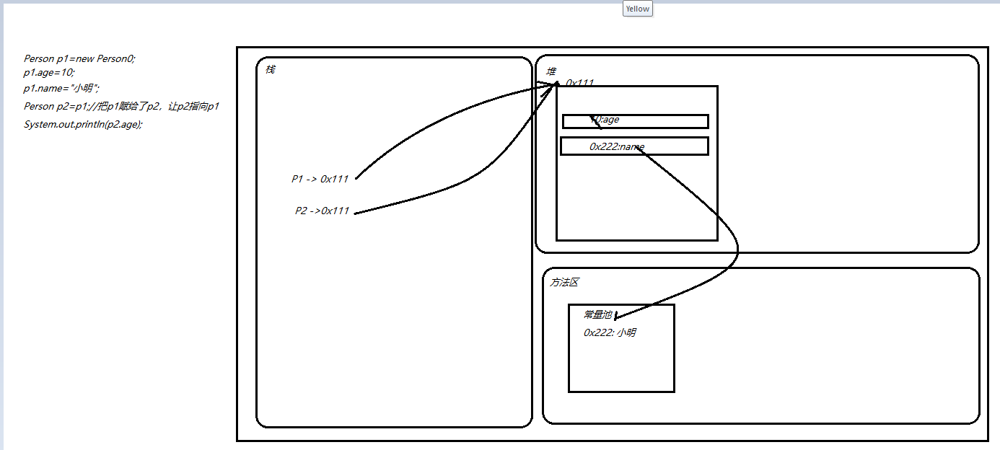
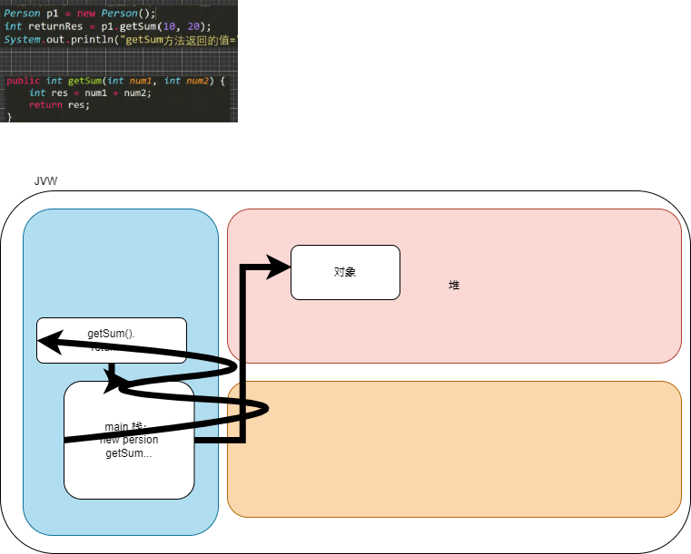
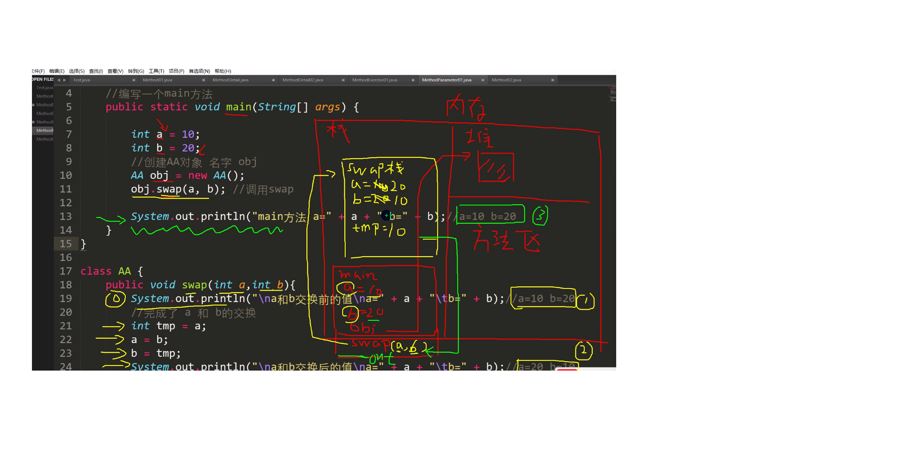
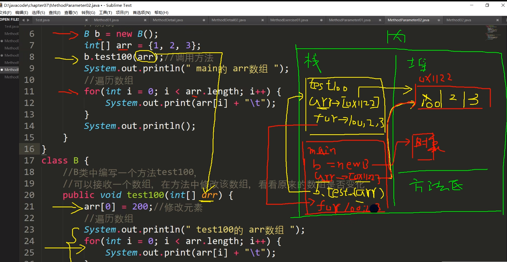
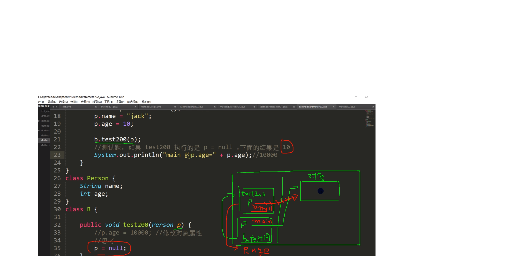
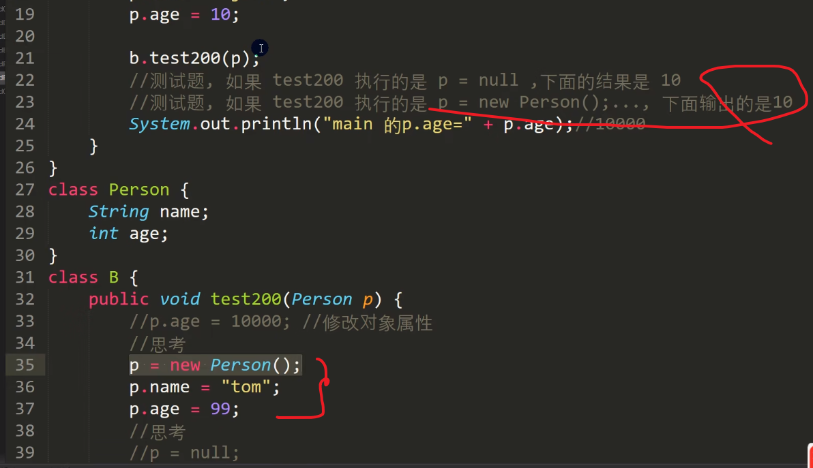

## How to use this readme file:
* https://github.com/timerring/backend-tutorial/blob/main/java-tutorial/ch07_oop_fundamentals.md#%E6%88%90%E5%91%98%E6%96%B9%E6%B3%95

> 内存图 - 对象在内存中存在形式
> 
> 注意：字符串本质上是一个引用类型，按照jvm的规则会把字符串放在方法区的常量池中间。 
> 栈中的是对象引用（对象名），实际上的对象在堆中。

> 内存图 - 核心：引用传递传递的是地址。
> 
 
> 内存图 - 成员方法
> 
> 调用机制总结： 1)main方法是程序的入口，
> 2)当程序执行到方法时，会在栈里开辟空间，-(压栈 ) 3)当方法执行完毕，或执行到return语句拿到返回值，方法就执行完毕 -(弹栈) 4)返回到方法调用的地方 5)返回后继续执行代码
> 6)执行到main方法结束，整个程序退出
>

### 成员方法传参机制
>  Refer ./MethodParameter01.java 
> 
> Refer : ./MethodParameter02.java
>
> IMPORTANT!!!  思考: 引用传递, 当 p=null，相当于栈里的对象不再指向堆内的空间, 指向null
> Extend content and refer:  new Person() in method test200, will be handle by GC
Practice: MethodExercise02.java

### 方法递归调用 (recursion)

