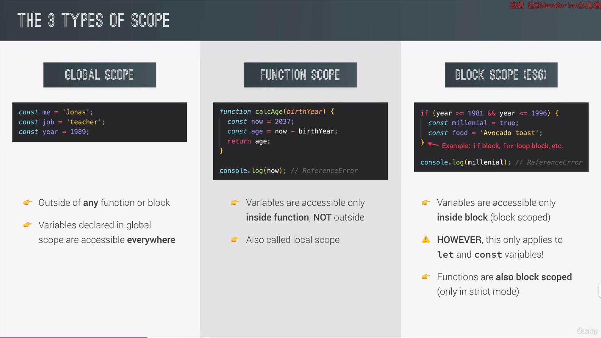
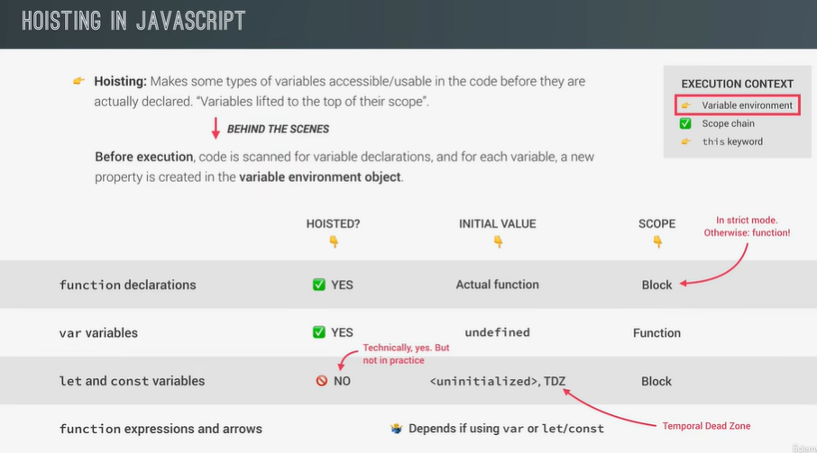
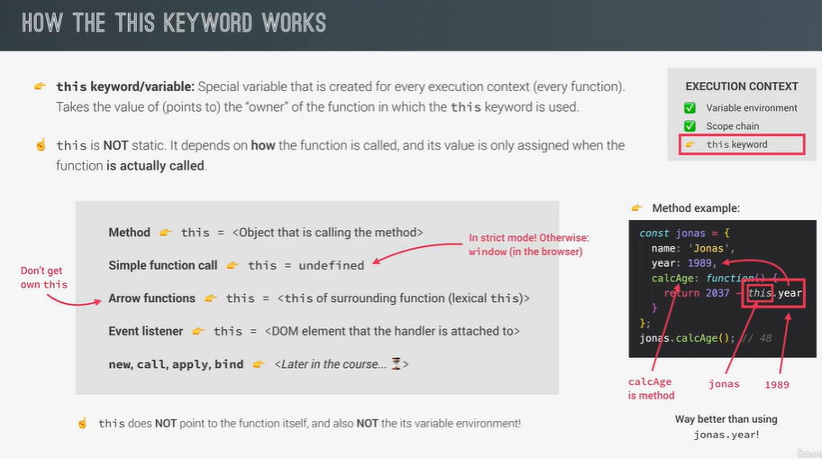

## Feature of Javascript

> point about concurrency: there is a function called **event loop**, let function run in the back and put the result back to the main thread.

## What is a Javascript engine?

> Program that executes Javascript code. Example: V8 engine.

> And JS Engine combines with **call stack**(execute code) and **heap**(stored in mermeory)

#### Compilation vs. Interpretation

> Just-in-time compilation: entire code is coverted into machine code at once, then executr immediatrly (NOT a portable file)
> Flow: Parsing -> compilation -> execution

#### JavaScript Runtime

> How this(Event Loop) work?
> When callback function executed, then it is put into callback queue. And when callstack is empty, the callback function will be put into callstack to execute.

## What is an execution context?

> Global execution context: is created for top-level code
> environment in whichh a piece of javascript is executed. Stores all the necesary information for some code to be executed. For exmaple, when order a pizza, the Pizza is "JavaScript code", and the Pizza box act as "execution context".
> Flow: Compilation ----> Execution: global execution context, -> execution of top-level code(inside global EC) -> execution of functions and waiting for callbacks

---

> Note:
>
> - In JavaScript, there is only ever one global execution context(EC). // Default context, created for code that is not inside any function(top-level). --> only execute top-level code
> - One execution context per function: For each function call, a new execution context is created. --> All together make <b>the call stack</b>.

### What's inside execution context?

> 1 Variable Environment: (aka. in creation phrase)
>
> - let, const and var decalarations
> - Functions
> - arguments object
>   2 Scope chain:
>   3 this keyword
>   
>   Note: For <b>Arrow Funtcions</b> no "arguments obejct" and "this keyword"

### What's the Call Stack?

> - "Place" where execution contexts get stacked on top of each otther, to keep track of where we are in the execution
>   'the workflow for call stack >> same as java method invocation'
> - Overall, code run in call stack

## Scoping and Scope in JavaScript : Concepts

> - Scoping: how our program's variables are organized and accessed. _"Where do variables live?"_ or _"Where can we access a certain variable and where not?"_
> - Lexical scoping: Scoping is contrilled by placement of functions and blocks in the code;
> - Scope: Sapce or environment in which a certain varibale is **declared**(kinda like: variable enbironment in case of function). There is **global** scopr, **function** scope, and **block** scope.
> - Scope of a vaibale: region of our code where a certain variable can be accessed.
>    > _Note: scope has acccess to variables from all outer scope (aka. **variable lookup in scope chain**)_  
>    _Note: let and const are **block-scoped**_ >  _Sample: Scope chanin flow_ >  _Smaple: Scope Chian vs. Call Flow_ >  _pic: Summary_

---

## Hoisting in JavaScript

> Hoisting: Makes some types of variables accessible/ usable in the code before they are actually declared. "Variables lifted to the top of their scope." _---->_ **Before execution,** code is scanned for variable declaration, and for each variable, a new property is created in the **variable environment object** > 

### Temporal Dead Zone, let and const

Why it(TDZ) exist? to cathcn error and exception easier.
to makes const variables actually work.

Why hoisting? to use functions before actual declaration.

## How the this keyword works

